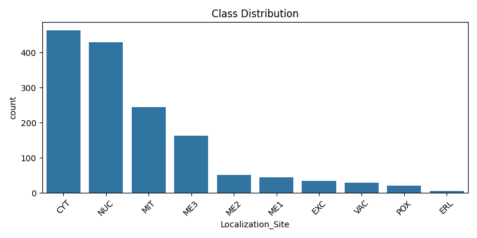
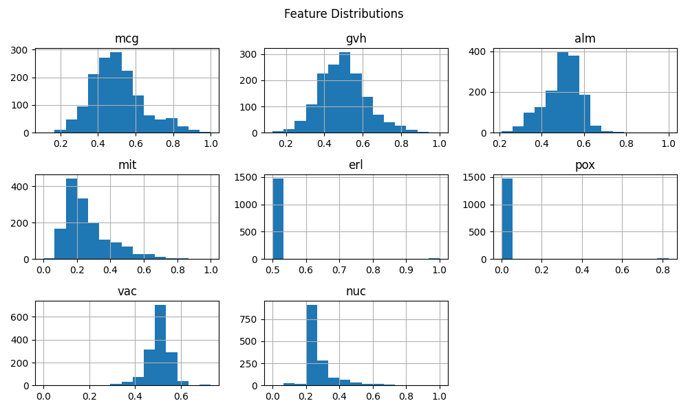
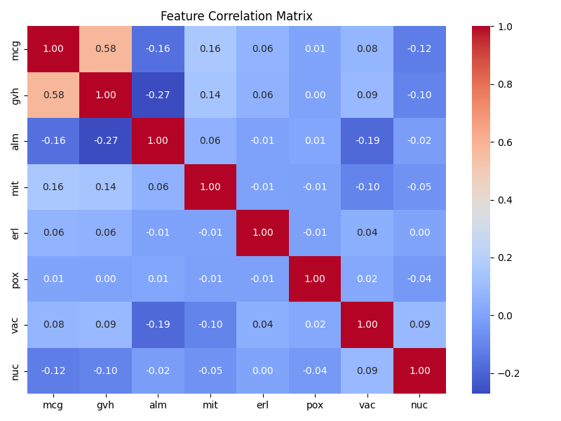
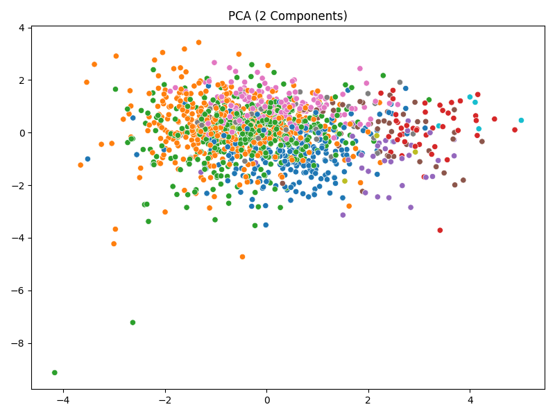
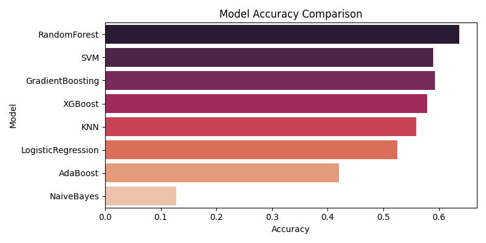
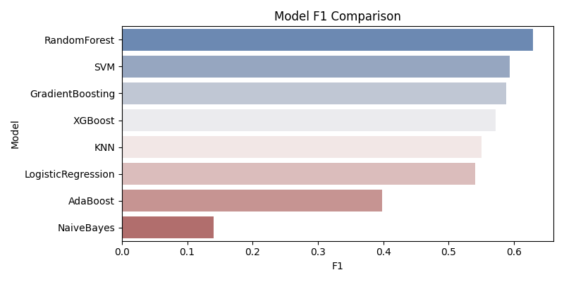
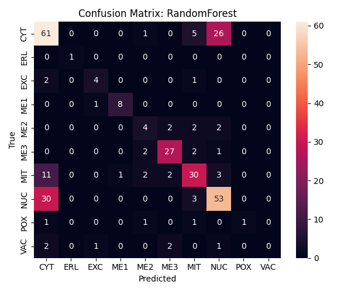
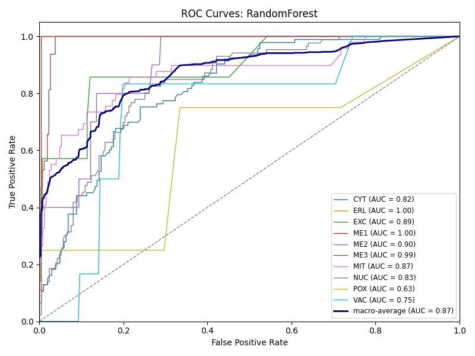

# Protein Localization Sites Prediction

This project focuses on predicting the cellular localization sites of proteins using various machine learning models. The dataset used is the Yeast dataset, which contains 8 predictive attributes and 1 target attribute (localization site).

---

## Dataset

**Source:**  
Kenta Nakai, Institute of Molecular and Cellular Biology, Osaka University  
Donated by Paul Horton

- **Number of Instances:** 1484  
- **Number of Attributes:** 9 (8 predictive, 1 name)  
- **Predicted Attribute:** Localization site of protein (non‑numeric)

### Attribute Information

| Attribute       | Description                                                                                                            |
|-----------------|------------------------------------------------------------------------------------------------------------------------|
| **Sequence Name** | Accession number for the SWISS‑PROT database.                                                                         |
| **mcg**         | McGeoch’s method for signal sequence recognition.                                                                      |
| **gvh**         | von Heijne’s method for signal sequence recognition.                                                                   |
| **alm**         | Score of the ALOM membrane‑spanning region prediction program.                                                          |
| **mit**         | Score of discriminant analysis of the amino acid content of the N‑terminal region (20 residues) for mitochondrial vs. non‑mitochondrial proteins. |
| **erl**         | Presence of “HDEL” substring (signal for retention in the endoplasmic reticulum lumen).                                |
| **pox**         | Peroxisomal targeting signal in the C‑terminus.                                                                         |
| **vac**         | Score of discriminant analysis of vacuolar vs. extracellular proteins.                                                  |
| **nuc**         | Score of discriminant analysis of nuclear localization signals of nuclear vs. non‑nuclear proteins.                    |

---

## Class Distribution

The localization site classes and their counts:

- **CYT** (cytosolic or cytoskeletal): 463  
- **NUC** (nuclear): 429  
- **MIT** (mitochondrial): 244  
- **ME3** (membrane protein, no N‑terminal signal): 163  
- **ME2** (membrane protein, uncleaved signal): 51  
- **ME1** (membrane protein, cleaved signal): 44  
- **EXC** (extracellular): 37  
- **VAC** (vacuolar): 30  
- **POX** (peroxisomal): 20  
- **ERL** (endoplasmic reticulum lumen): 5  

---

## Feature Distributions and Correlations

- **Histogram of each feature**:  
  

- **Correlation heatmap**:  
  

---

## PCA (2 Components)

Projection of the dataset onto its first two principal components to visualize class separability:

---

## Model Performance

Several models were evaluated on Accuracy and F1‑score.  

### Accuracy Comparison

| Model               | Accuracy |
|---------------------|----------|
| RandomForest        | 0.6364   |
| SVM                 | 0.5892   |
| GradientBoosting    | 0.5926   |
| XGBoost             | 0.5791   |
| KNN                 | 0.5589   |
| LogisticRegression  | 0.5253   |
| AdaBoost            | 0.4209   |
| NaiveBayes          | 0.1279   |

### F1‑Score Comparison

| Model               | F1‑Score |
|---------------------|----------|
| RandomForest        | 0.6291   |
| SVM                 | 0.5939   |
| GradientBoosting    | 0.5879   |
| XGBoost             | 0.5724   |
| KNN                 | 0.5510   |
| LogisticRegression  | 0.5412   |
| AdaBoost            | 0.3987   |
| NaiveBayes          | 0.1405   |

---

## Best Performing Model

**RandomForest** emerged as the top performer.

- **Accuracy:** 0.6364  
- **F1‑Score:** 0.6291  

The pipeline for RandomForest was saved to `best_model.pkl`.

---

### Confusion Matrix (RandomForest)

Breakdown of true vs. predicted classes:

---

### ROC Curves (RandomForest)

Receiver Operating Characteristic curves for each class and the macro‑average:

---

*End of report.*  

